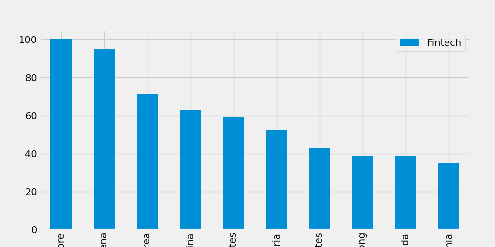

# Google-Search-Analysis
Learning how to analyze google search trends using Python. 
This is a quick project showing the top 10 countries that searched for "Fintech" as of January and February 2026.

## Installation
Uset the package manager pip to install pytrends.
```bash
pip install pytrends pandas matplotlib
```

## Usage
Run the python program:
``` bash
python fintech_trends.py
```

## Technologies Used
* Python
* pytrends
* pandas
* matplotlib 
* VSCode (platform)

## What the Script Does
1) _Connect to Google Trends_: searches for keyword "Fintech"
2) _Prints 3 DataFrames in the terminal_: 

    a) Top 10 dates in the last 12 months when "Fintech" was most searched

    b) Search interest for Jan-Feb 2026 specifically

    c) Top 10 countries/regions where "Fintech" is most searched
 
3) _Shows a bar char_: a popup window with a bar graph of regional interest

4) _Fetches related queries_: search terms related to "Fintech" on Google

5) _Prints keyword suggestions_: other keywords Google associates with "Fintech"

## Sample Output


## Future Implications/Uses
* _Compare multiple keywords_ - e.g. "Fintech" versus "Crypto" versus "Blockchain" to see which one is gaining traction

* _Track trends over time_ - run the script monthly and log results to a CSV to build a historical dataset

* _Geographic Targeting_ - drill into specific countries to see where Fintech interest is growing fastest, useful for market entry analysis

* _Feed into dashboards_ - pipe the data into Tableau, Power BI, or a somple Flask app for live visualization

* _Investment/research signal_ - search trend spikes often precede news cycles, useful as a soft indicator for analysts

## What I Learned
* How to connect to the Google Trends API using the pytrends library to fetch real-time search data
* How to retrieve and sort data to identify when a keyword peaks in popularity
* How to filter search by a specific timeframe
* How to visualize data using matplotlib (bar charts) and save charts as images
* How to use pandas DataFrames to sort, filter, and display structured data
* How to handle API rate limiting with `time.sleep()` and the `retries` parameter
* How to debug a Python script by reading terminal errors and fixing issues with `print()` statements 